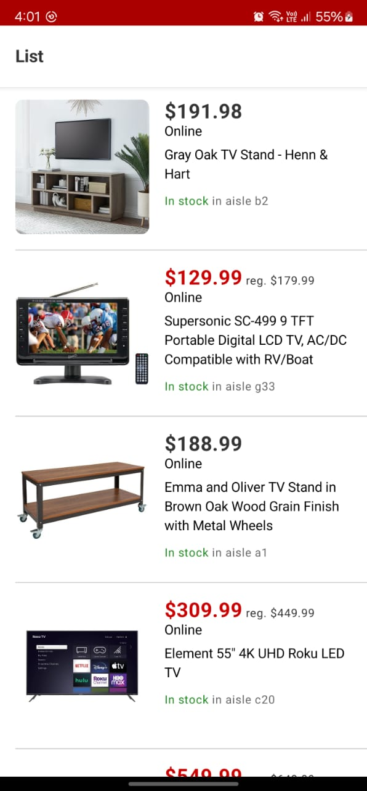
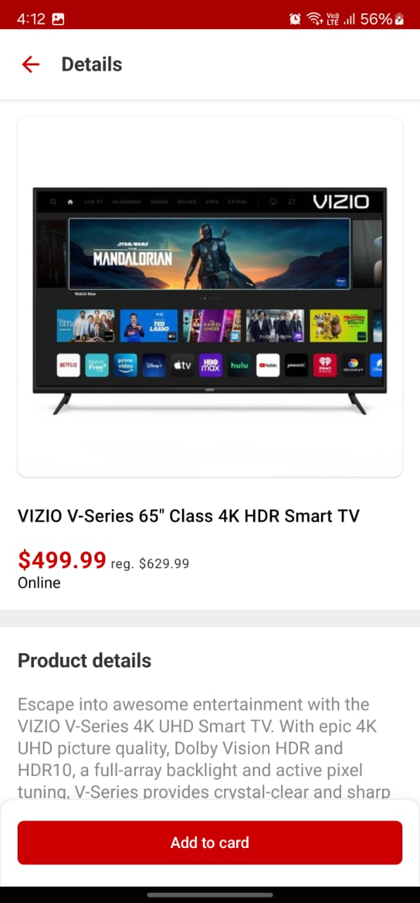

## Android Case Study

The goal of the app is to display a list of deals currently offered by Target, and to provide information on those
 deals. As a POC, the app has a few deals hardcoded in and the code is pretty rough. It is your job to turn this app into something useful!

## Screenshots

  
  

